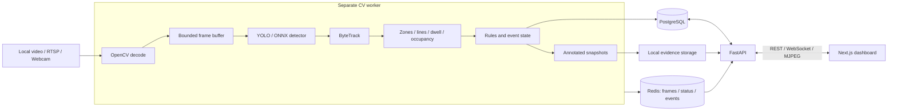

# VigilAI

**Video analytics with persistent tracking, configurable rules, and reviewable evidence.**

VigilAI turns local video, RTSP streams, and webcam input into tracked objects, zone occupancy, directional line crossings, dwell alerts, and persisted events. A separate computer vision worker runs inference while a Next.js dashboard lets operators configure cameras and investigate alerts.

Built as an applied computer vision and software engineering portfolio project. The focus is the complete path from video to evidence, with explicit state, bounded buffering, and testable analytics.

[Quick start](#quick-start) · [Architecture](ARCHITECTURE.md) · [Operations](OPERATIONS.md) · [Engineering decisions](docs/decisions) · [Validation](docs/VALIDATION.md)

## Engineering highlights

| Problem | Implementation to review |
| --- | --- |
| Inference must not block HTTP requests | [Separate worker](apps/worker/main.py) and per-camera pipelines |
| Slow inference must not create unlimited backlog | [Bounded buffer](apps/worker/frame_buffer.py) with drop-oldest behavior |
| Detections need identity across frames | [ByteTrack implementation](apps/api/vigilai_api/cv/tracking/byte_tracker.py) with Kalman prediction and association |
| Analytics require temporal state | [Zone, line, dwell, and counting modules](apps/api/vigilai_api/cv/analytics) |
| Alerts must not fire on every frame | [Rule evaluation](apps/api/vigilai_api/cv/rules/engine.py) and [event lifecycle management](apps/api/vigilai_api/cv/events/manager.py) |
| An alert needs evidence | [Annotated snapshots](apps/api/vigilai_api/cv/evidence/capture.py), PostgreSQL events, and an authenticated events UI |
| Geometry must survive display resizing | [Normalized zone/line editor](apps/web/src/components/cameras/zone-editor.tsx) and independent geometry logic |

## Architecture



**Stack:** Python 3.12 · FastAPI · SQLAlchemy / Alembic · PostgreSQL 16 · Redis 7 · Ultralytics YOLO · OpenCV · ByteTrack · ONNX Runtime · Next.js 15 · React 19 · TypeScript · Tailwind CSS · Docker Compose.

## Quick start

Requires Git, Docker with Compose, and enough disk space for the PyTorch container images. The default uses CPU inference; no physical camera is needed for a local-video demo. Initial model loading may download YOLO weights and requires internet access.

```bash
git clone https://github.com/sohaib-0897/VigilAi.git
cd VigilAi
cp .env.example .env
```

In PowerShell, use `Copy-Item .env.example .env`. Before startup, replace `SECRET_KEY` with a random secret and `ENCRYPTION_KEY` with a persistent Fernet key. [Operations](OPERATIONS.md) includes key-generation commands. The checked-in database defaults are for local development only.

```bash
docker compose up -d --build
```

The API container runs migrations at startup. Open **http://localhost:3000/register** to create your own account, then sign in. API documentation is at **http://localhost:8000/docs**. Check services with `docker compose ps` and `docker compose logs api worker`.

### Demo workflow

1. Add a local-video camera from Cameras and upload a video containing people or vehicles.
2. Open its configuration page and draw a polygon zone or virtual line over the preview.
3. Create a matching rule, such as zone entry, line crossing, or a dwell threshold.
4. Start analytics and inspect the annotated feed and persistent track IDs.
5. Open Events, select a triggered event, and inspect the saved snapshot and metadata.
6. Review historical analytics and worker health in the dashboard.

Use footage you have permission to process. Choose a zone or line that objects actually enter or cross; alerts depend on video content and the configured rule.

### Local development

Requires Python 3.12 and Node.js 22. Copy and configure `.env` first.

```bash
docker compose up -d postgres redis
python -m pip install -e ".[dev]"
python -m alembic upgrade head
python -m uvicorn vigilai_api.main:app --reload --port 8000
```

Run the worker in a second terminal:

```bash
python -m apps.worker.main
```

Run the frontend in a third terminal:

```bash
cd apps/web
npm ci
npm run dev
```

## Verification

```bash
python -m pytest tests -q
cd apps/web
npm run build
```

Tests cover geometry, tracking analytics, rules, event deduplication, authentication boundaries, and runtime regressions. CPU tests use controlled inputs where appropriate; they are not accuracy evaluations or throughput benchmarks. [Validation notes](docs/VALIDATION.md) distinguish automated checks, live smoke scripts, and measurements.

## Models, training, and benchmarks

```bash
# Requires an annotated dataset with appropriate splits
python scripts/train.py --data path/to/data.yaml --epochs 100 --batch 16
python scripts/evaluate.py --model path/to/best.pt --data path/to/data.yaml --split test

# Requires an existing PyTorch weights file
python scripts/export_onnx.py --model models/best.pt --output models/best.onnx

# Measures actual model execution on synthetic input
python scripts/benchmark.py --model models/best.pt --backend pytorch --warmup 10 --runs 100 --output benchmarks/results.json
```

Set `YOLO_MODEL_PATH` to select weights or an ONNX model. JSON files in [benchmarks](benchmarks) are retained measurement artifacts with [scope and caveats](benchmarks/README.md). Their inference timings do not represent end-to-end video throughput. Dataset precision, recall, mAP, GPU throughput, and TensorRT gains are **NOT_MEASURED** in this repository's published validation.

## Repository map

```text
apps/api/vigilai_api/   API, database models, services, and CV modules
apps/api/migrations/    PostgreSQL Alembic migrations
apps/worker/            Camera lifecycle, bounded pipeline, and telemetry
apps/web/               Next.js dashboard and geometry editor
tests/                  CPU-testable logic and API/runtime checks
scripts/                Training, evaluation, export, benchmark, smoke checks
docker/                 API, worker, and frontend images
docs/decisions/         Architecture decision records
benchmarks/             Recorded measurement artifacts
```

## Scope and limitations

- One host and one worker managing multiple cameras. Distributed camera assignment is not implemented.
- Live preview uses MJPEG over HTTP; WebRTC and event clips are not implemented.
- Evidence uses local storage. Retention automation and object storage are not implemented.
- Dropping stale frames bounds backlog but can miss fast transitions and affect tracking. End-to-end latency depends on queue size, source rate, and hardware.
- RTSP and webcam adapters exist; physical-camera reliability and GPU deployment require environment-specific validation.
- Training and evaluation commands exist; no fine-tuned accuracy claim is made. TensorRT remains optional and unverified.
- This is a portfolio implementation with production-oriented design choices, not a claim of audited production readiness.

## License

Project source is licensed under [MIT](LICENSE). Third-party libraries, model weights, and datasets retain their own licenses.
