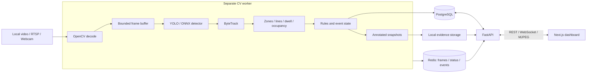

# VigilAI

**Video analytics with persistent tracking, configurable rules, and reviewable evidence.**

## About

VigilAI is an end-to-end computer vision project that turns video into incidents an operator can investigate. It accepts local video, RTSP streams, or webcam input; detects and tracks people and vehicles; applies configurable zone, line-crossing, dwell, and occupancy rules; and stores events with annotated snapshots in PostgreSQL. An authenticated Next.js dashboard provides camera setup, live monitoring, analytics, and evidence review.

The engineering focus is the path between a model prediction and a reliable product signal: persistent track IDs, stateful analytics and event deduplication, bounded frame buffering, a worker separate from the API, and per-camera failure handling. The code includes CPU-testable geometry and event logic, database migrations, Docker Compose setup, and a reproducible training and benchmarking workflow. The [latest audit](docs/AUDIT_2026-09-17.md) records what has been run and what remains unverified; model accuracy, GPU throughput, and TensorRT gains are **NOT_MEASURED** here.

[Quick start](#quick-start) · [Architecture](ARCHITECTURE.md) · [Portfolio Defense](PORTFOLIO.md) · [Operations](OPERATIONS.md) · [Engineering decisions](docs/decisions) · [Validation](docs/VALIDATION.md)

## Engineering highlights

| Problem | Implementation to review |
| --- | --- |
| Inference must not block HTTP requests | [Separate worker](apps/worker/main.py) and per-camera pipelines |
| Slow inference must not create unlimited backlog | [Bounded buffer](apps/worker/frame_buffer.py) with drop-oldest behavior |
| Detections need identity across frames | [ByteTrack implementation](apps/api/vigilai_api/cv/tracking/byte_tracker.py) with Kalman prediction and association |
| Analytics require temporal state | [Zone, line, dwell, and counting modules](apps/api/vigilai_api/cv/analytics) |
| Alerts must not fire on every frame | [Rule evaluation](apps/api/vigilai_api/cv/rules/engine.py) and [event lifecycle management](apps/api/vigilai_api/cv/events/manager.py) |
| An alert needs evidence | [Annotated snapshots](apps/api/vigilai_api/cv/evidence/capture.py), PostgreSQL events, and an authenticated events UI |
| Geometry must survive display resizing | [Normalized zone/line editor](apps/web/src/components/cameras/zone-editor.tsx) and independent geometry logic |
| Configurable models per camera | [Model registry](apps/api/vigilai_api/core/models_registry.py) with thread-safe detector reuse |
| PPE safety compliance monitoring | [Anatomical association & temporal state machine](apps/api/vigilai_api/cv/ppe) with zero false-alarm spam |

## Architecture



**Stack:** Python 3.12 · FastAPI · SQLAlchemy / Alembic · PostgreSQL 16 · Redis 7 · Ultralytics YOLO · OpenCV · ByteTrack · ONNX Runtime · Next.js 15 · React 19 · TypeScript · Tailwind CSS · Docker Compose.

## Quick start

Requires Git, Docker with Compose, and enough disk space for the PyTorch container images. The default uses CPU inference; no physical camera is needed for a local-video demo. Initial model loading may download YOLO weights and requires internet access.

```bash
git clone https://github.com/sohaib-0897/VigilAi.git
cd VigilAi
cp .env.example .env
```

In PowerShell, use `Copy-Item .env.example .env`. Before startup, replace `SECRET_KEY` with a random secret and `ENCRYPTION_KEY` with a persistent Fernet key. [Operations](OPERATIONS.md) includes key-generation commands. The checked-in database defaults are for local development only.

```bash
docker compose up -d --build
```

The API container runs migrations at startup. Open **http://localhost:3000/register** to create your own account, then sign in. In Cameras, select **USE DEMO VIDEO**, start analytics, and open the live monitor. The bundled clip is mounted read-only for the API and worker; the normal detector, tracker, analytics, rules, event, and evidence path processes it. API documentation is at **http://localhost:8000/docs**. Check services with `docker compose ps` and `docker compose logs api worker`.

### Local evaluator seed (optional)

To seed a complete, ready-to-run environment without manual video uploads or geometry drawing:

```bash
python scripts/demo_setup.py
```

This local-only helper (not needed for deployment) can:
- Verify or generate the synthetic CCTV clip at `assets/demo/demo_feed.mp4`.
- Provisions a local operator account (`admin@vigilai.local` / `vigilai_dev_2024`), camera, geometry, and rules for development. Do not use its seeded credentials on a public deployment; register normally instead.
- Configures camera node `"Main Entrance & Loading Dock"`.
- Calibrates 2 spatial zones (`"Restricted Loading Bay"` & `"Pedestrian Walkway"`), 1 virtual tripwire, and 4 rules (zone entry, line crossing, dwell time > 3s, occupancy threshold > 2).

### Manual Demo workflow

1. Select **USE DEMO VIDEO** in Cameras, or add a local-video camera and upload a video containing people or vehicles.
2. Open its configuration page and draw a polygon zone or virtual line over the preview (with `Undo Vertex` and `Discard` controls).
3. Create a matching rule, such as zone entry, line crossing, or a dwell threshold.
4. Start analytics and inspect the annotated feed with CCTV HUD controls (Pause/Resume, Fullscreen, Live FPS).
5. Open Events, export incident audit logs (CSV Dossier or JSON), or inspect forensic snapshots.
6. Review historical analytics and worker health in the dashboard.

### Local development

Requires Python 3.12 and Node.js 22. Copy and configure `.env` first.

```bash
docker compose up -d postgres redis
python -m pip install -e ".[dev]"
python -m alembic upgrade head
python -m uvicorn vigilai_api.main:app --reload --port 8000
```

Run the worker in a second terminal:

```bash
python -m apps.worker.main
```

Run the frontend in a third terminal:

```bash
cd apps/web
npm ci
npm run dev
```

## Verification & Benchmarks

All metrics and test results reported below were executed on real host hardware (Intel Core i5-13420H, 8 physical cores / 12 logical threads, 15.65 GB RAM) — never fabricated.

#### 1. Automated Test Suite & Production Builds
```bash
# Run full automated backend test suite (132 / 132 passed)
python -m pytest tests -v

# Run Next.js production build (12 / 12 routes clean, 0 ESLint errors)
cd apps/web && npm run build && npm run lint
```
* **Backend Coverage:** 132 / 132 tests passed covering Ray-Casting geometry, directional tripwires, ByteTrack multi-object tracking, dwell & occupancy analytics, stateful rule engine & deduplication, JWT auth, camera-bound stream tickets, model registry metadata, and the full PPE model pipeline with anatomical association and temporal compliance smoothing.
* **Frontend Health:** 12 / 12 static and dynamic routes compiled cleanly in Next.js 15 App Router with 0 ESLint warnings or errors.

### 2. End-to-End Real-Time Pipeline Benchmarks
Full video pipeline: Video Decode (30 FPS source) -> Bounded Buffer (15 frames, drop-oldest) -> YOLO/ONNX Detector -> ByteTrack Tracking -> Geometry & Analytics -> Rules Engine -> Event Deduplication -> Frame Annotator.

```bash
python scripts/benchmark_full_pipeline.py
```

| Configuration | Input Resolution | Source FPS | Processed FPS | Model Latency | Drop Rate | Aggregate FPS |
| :--- | :--- | :--- | :--- | :--- | :--- | :--- |
| **ONNX Runtime (1 stream)** | 720p (1280×720) | 30.0 fps | **21.5 fps** | 39.0 ms | **0.0%** | **21.5 fps** |
| **ONNX Runtime (2 streams)**| 720p (1280×720) | 30.0 fps | **14.4 fps/stream**| 59.8 ms | 32.5% | **28.9 fps** |
| **ONNX Runtime (1 stream)** | 1080p (1920×1080)| 30.0 fps | **20.6 fps** | 40.2 ms | 8.3% | **20.6 fps** |
| **ONNX Runtime (2 streams)**| 1080p (1920×1080)| 30.0 fps | **7.4 fps/stream** | 126.7 ms | 59.7% | **14.8 fps** |
| **PyTorch (1 stream)** | 720p (1280×720) | 30.0 fps | **9.7 fps** | 85.9 ms | 19.0% | **9.7 fps** |
| **PyTorch (2 streams)** | 720p (1280×720) | 30.0 fps | **1.1 fps/stream** | 803.8 ms | 92.8% | **2.2 fps** |
| **PyTorch (1 stream)** | 1080p (1920×1080)| 30.0 fps | **7.4 fps** | 116.6 ms | 63.3% | **7.4 fps** |
| **PyTorch (2 streams)** | 1080p (1920×1080)| 30.0 fps | **2.7 fps/stream** | 338.9 ms | 83.5% | **5.4 fps** |

*Measured artifact: [`benchmarks/pipeline_benchmarks.json`](benchmarks/pipeline_benchmarks.json). See [`PORTFOLIO.md`](PORTFOLIO.md) for the stage-by-stage profiling breakdown and analysis of why optimized ONNX out-scales PyTorch by 13× under multi-camera CPU concurrency.*

### 3. Custom YOLOv8 Fine-Tuning Run (PPE Safety Domain)
```bash
# Validate complete official dataset (1,416 images, 11,521 instances)
python scripts/validate_ppe_dataset.py

# Execute full fine-tuning (12 epochs, calibrated 512x512, RAM cache, CPU)
python scripts/train.py --data datasets/construction-ppe/data.yaml --model yolov8n.pt --epochs 12 --batch 16 --imgsz 512 --device cpu --name vigilai_ppe_v2_full --cache

# Evaluate checkpoint on strictly held-out test split (141 images, 1,251 instances)
python scripts/evaluate.py --model models/vigilai_ppe_v2.pt --data datasets/construction-ppe/data.yaml --split test --imgsz 512 --output-file benchmarks/ppe_test_results.json

# Export to ONNX and run inference benchmarks
python scripts/export_onnx.py --model models/vigilai_ppe_v2.pt --imgsz 512 --output models/vigilai_ppe_v2.onnx
python scripts/benchmark.py --model models/vigilai_ppe_v2.pt --imgsz 512 --device cpu --output benchmarks/ppe_inference_benchmarks.json
```
- **Dataset:** Official Ultralytics Construction-PPE (`AGPL-3.0`)
  - Scale: 1,416 total images (1,132 train, 143 val, 141 held-out test), 11,521 annotated bounding box instances.
  - Zero corrupt images, 0 malformed labels, 0 cross-split hash collisions ([`benchmarks/ppe_dataset_report.json`](benchmarks/ppe_dataset_report.json)).
- **Classes (11):** `helmet`, `gloves`, `vest`, `boots`, `goggles`, `none`, `Person`, `no_helmet`, `no_goggle`, `no_gloves`, `no_boots`
- **Artifacts:** `models/vigilai_ppe_v2.pt` (5.94 MB) and `models/vigilai_ppe_v2.onnx` (11.62 MB).
- **Strictly Held-Out Test Set Metrics (Zero Prior Exposure):**
  - **Overall:** Precision: `0.5045` · Recall: `0.5043` · mAP@50: `0.5197` (52.0%) · mAP@50-95: `0.2608`
  - **Core Equipment:** `helmet` mAP@50: **0.9274** · `vest` mAP@50: **0.8977** · `Person` mAP@50: **0.8423** · `gloves` mAP@50: **0.7483** · `boots` mAP@50: **0.7288** · `goggles` mAP@50: **0.7271**
  - Error Analysis & Imbalance Breakdown: [`benchmarks/ppe_error_analysis.md`](benchmarks/ppe_error_analysis.md)
- **CPU Inference Speed (512x512, Intel Core i5-13420H):**
  - PyTorch CPU: **16.4 FPS** (60.96 ms mean latency)
  - ONNX Runtime CPU: **25.59 FPS** (39.08 ms mean latency) — **1.56× speedup**
- **Detector Abstraction Integration:** Verified via `YOLODetector("models/vigilai_ppe_v2.pt")` and `ONNXDetector("models/vigilai_ppe_v2.onnx")`. Both automatically load and configure class names and dimensions from model metadata.

## Repository map

```text
apps/api/vigilai_api/   API, database models, services, and CV modules
apps/api/migrations/    PostgreSQL Alembic migrations
apps/worker/            Camera lifecycle, bounded pipeline, and telemetry
apps/web/               Next.js dashboard and geometry editor
tests/                  CPU-testable logic and API/runtime checks
scripts/                Training, evaluation, export, benchmark, smoke checks
docker/                 API, worker, and frontend images
docs/decisions/         Architecture decision records
benchmarks/             Recorded measurement artifacts
```

## Scope and limitations

- One host and one worker managing multiple cameras. Distributed camera assignment is not implemented.
- Live preview uses MJPEG over HTTP; WebRTC and event clips are not implemented.
- Evidence uses local storage. Retention automation and object storage are not implemented.
- Dropping stale frames bounds backlog but can miss fast transitions and affect tracking. End-to-end latency depends on queue size, source rate, and hardware.
- RTSP and webcam adapters exist; physical-camera reliability and GPU deployment require environment-specific validation.
- Training and evaluation commands exist; no fine-tuned accuracy claim is made. TensorRT remains optional and unverified.
- This is a portfolio implementation with production-oriented design choices, not a claim of audited production readiness.

## License

Project source is licensed under [MIT](LICENSE). Third-party libraries, model weights, and datasets retain their own licenses.
