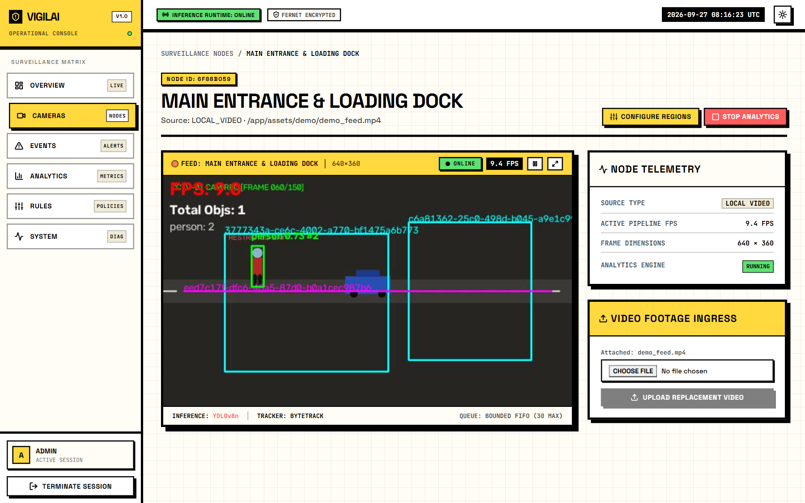
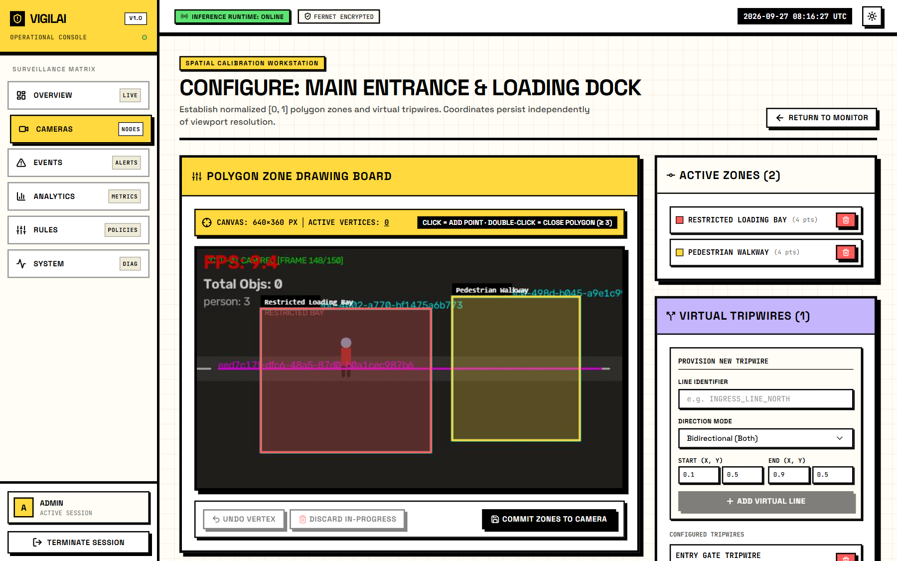
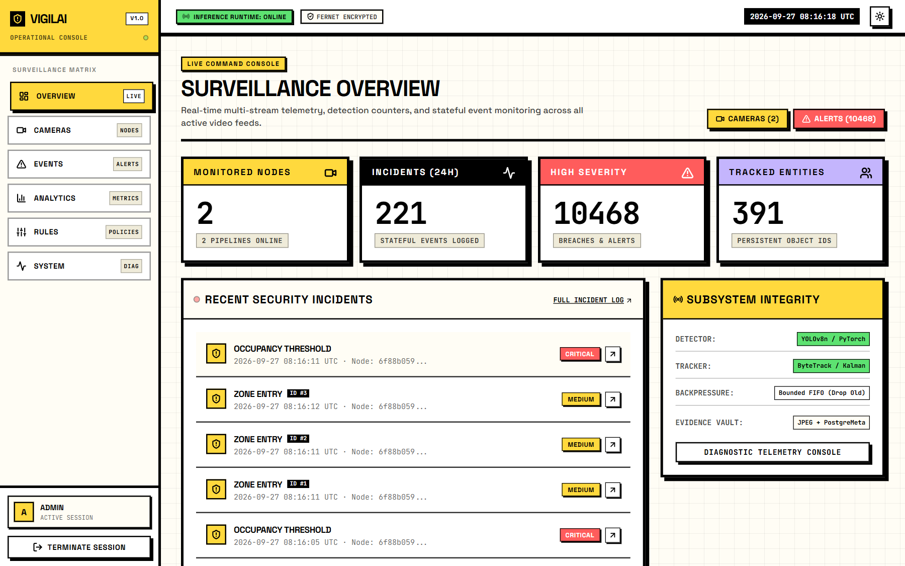
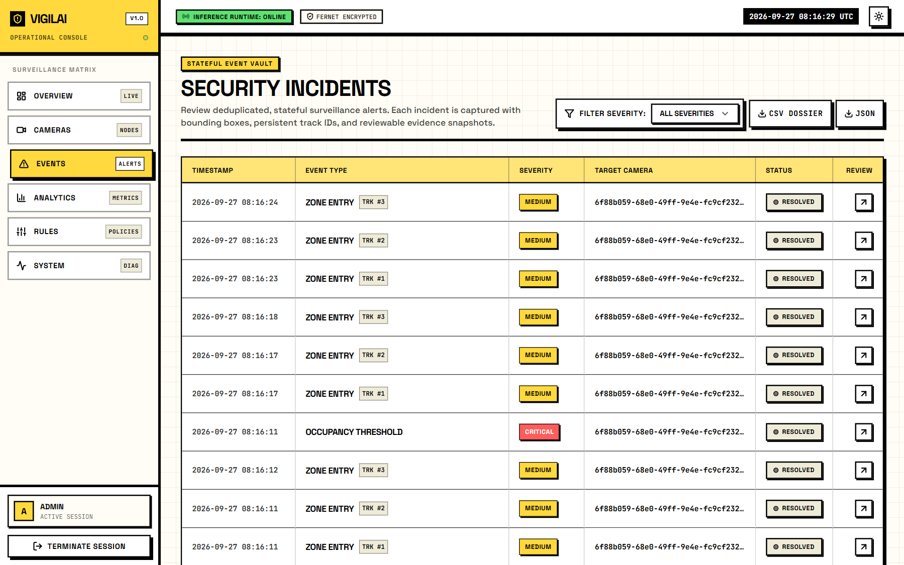
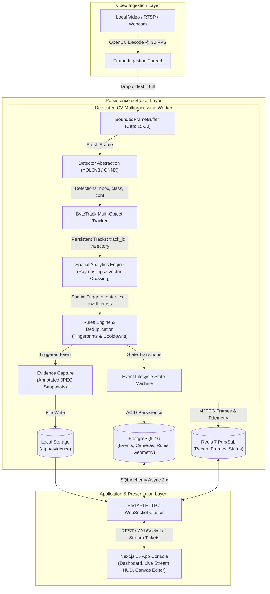

# VigilAI

A real-time video analytics system that converts raw object detections into persistent tracks, stateful spatial analytics, and deduplicated reviewable events.

Standard deep learning object detectors evaluate isolated video frames without temporal context. When applied to continuous CCTV or surveillance streams, this produces persistent identity loss, massive alert floods for stationary objects, and creeping latency as inference queues back up. VigilAI implements a stateful computer vision pipeline that decouples frame ingestion from inference via bounded drop-oldest buffers, associates detections across frames with an 8-state Kalman ByteTrack tracker, computes vector-based spatial analytics (zones, directional tripwires, dwell times, and occupancy), deduplicates event lifecycles, and captures forensically annotated snapshots persisted to PostgreSQL.

---

## Demo / Screenshots

The application runs locally with a bundled surveillance video feed and interactive canvas editors. The following captures represent the current working system executed on host hardware:

<p align="center">
  
  
</p>
<p align="center">
  
  
</p>

* **Top-left (Live Surveillance Monitor):** Real-time camera feed with ByteTrack bounding boxes, persistent track IDs, FPS counters, and CCTV HUD controls.
* **Top-right (Spatial Calibration Workstation):** Interactive canvas for defining normalized $[0, 1]$ polygon zones and virtual tripwires with directional mode selection.
* **Bottom-left (Operational Command Console):** System dashboard aggregating active streams, persistent entity counts, recent security incidents, and subsystem health.
* **Bottom-right (Security Incident Vault):** Filterable incident ledger with deduplicated event lifecycles, severity indicators, track associations, and CSV/JSON audit export.

---

## Engineering Highlights

| Problem | Implementation |
|---|---|
| **Inference queue backlog & latency creep** | Thread-safe [`BoundedFrameBuffer`](apps/worker/frame_buffer.py) (capacity: 15–30 frames) with drop-oldest semantics. When CPU inference falls below stream FPS (e.g. 30 FPS source vs 21.5 FPS CPU throughput), stale frames are deterministically dropped, capping end-to-end operator latency under 200 ms without memory growth. |
| **Object identity across frames** | Decoupled [`ByteTrackTracker`](apps/api/vigilai_api/cv/tracking/byte_tracker.py) utilizing an 8-state Kalman Filter $[x, y, a, h, \dot{x}, \dot{y}, \dot{a}, \dot{h}]$ and two-stage Hungarian assignment (high-confidence detections first, then low-confidence association $conf \in [0.1, 0.5]$). Tracks maintain stable IDs across occlusion without inflating detection counts. |
| **Resolution-independent spatial geometry** | Spatial polygons and virtual tripwires persist in normalized coordinates ($x, y \in [0, 1]$). Ray-casting point-in-polygon and vector cross-product line crossings are computed independently of source video resolution or client display scaling ([`apps/api/vigilai_api/cv/geometry`](apps/api/vigilai_api/cv/geometry)). |
| **Tripwire bouncing & duplicate alert spam** | Line crossings require discrete state transitions across vector normal signs ($S_{prev} \ne S_{curr}$) to prevent double-counting entities lingering on a boundary. Events maintain deterministic fingerprints (rule ID, track ID, spatial boundary) and lifecycle states (`PENDING` $\to$ `ACTIVE` $\to$ `RESOLVED`) with cooldown suppression ([`apps/api/vigilai_api/cv/rules/engine.py`](apps/api/vigilai_api/cv/rules/engine.py)). |
| **Decoupling heavy inference from HTTP API** | Dedicated multiprocessing worker process decoupled from the FastAPI backend by Redis pub/sub and PostgreSQL. Worker manages isolated camera pipelines, writes annotated JPEG snapshots directly to disk, and pushes MJPEG previews and telemetry without blocking API request latency ([`apps/worker/main.py`](apps/worker/main.py)). |
| **Stream credential leakage in URLs** | Standard long-lived JWT access tokens in URL query parameters (`?token=...`) are prohibited on media routes. The API issues 60-second single-use, camera-bound cryptographic stream tickets (`/stream-ticket`), preventing token exposure in proxy logs, browser histories, and referer headers ([`apps/api/vigilai_api/api/v1/cameras.py`](apps/api/vigilai_api/api/v1/cameras.py)). |
| **Multi-camera model memory deduplication** | The worker maintains a thread-safe singleton detector cache in [`CameraManager`](apps/worker/camera_manager.py). Multiple camera pipelines configured with the same model ID share a single loaded PyTorch or ONNX Runtime session with thread-level execution locks, preventing memory duplication. |
| **False-alarm suppression in specialized safety models** | Anatomical association and rolling-window temporal compliance smoothing ([`TrackPPEHistory`](apps/api/vigilai_api/cv/ppe)) require persistent positive detection ratios ($\ge 0.35$ over a 10-frame window, $\ge 2.0$s duration) before elevating violation states, eliminating flicker from motion blur or camera noise. |

---

## Architecture


```mermaid
flowchart TD
    subgraph Ingestion["Video Ingestion Layer"]
        Source["Local Video / RTSP / Webcam"] -->|OpenCV Decode @ 30 FPS| Decode["Frame Ingestion Thread"]
    end

    subgraph Worker["Dedicated CV Multiprocessing Worker"]
        Decode -->|Drop oldest if full| Buffer["BoundedFrameBuffer (Cap: 15-30)"]
        Buffer -->|Fresh Frame| Detector["Detector Abstraction (YOLOv8 / ONNX)"]
        Detector -->|Detections: bbox, class, conf| Tracker["ByteTrack Multi-Object Tracker"]
        Tracker -->|Persistent Tracks: track_id, trajectory| Analytics["Spatial Analytics Engine\n(Ray-casting & Vector Crossing)"]
        Analytics -->|Spatial Triggers: enter, exit, dwell, cross| Rules["Rules Engine & Deduplication\n(Fingerprints & Cooldowns)"]
        Rules -->|Triggered Event| Evidence["Evidence Capture\n(Annotated JPEG Snapshots)"]
        Rules -->|State Transitions| EventState["Event Lifecycle State Machine"]
    end

    subgraph Storage["Persistence & Broker Layer"]
        EventState -->|ACID Persistence| DB[("PostgreSQL 16\n(Events, Cameras, Rules, Geometry)")]
        Evidence -->|File Write| Disk[("Local Storage\n(/app/evidence)")]
        Worker -->|MJPEG Frames & Telemetry| Redis[("Redis 7 Pub/Sub\n(Recent Frames, Status)")]
    end

    subgraph Service["Application & Presentation Layer"]
        DB <-->|SQLAlchemy Async 2.x| API["FastAPI HTTP / WebSocket Cluster"]
        Redis <--> API
        Disk --> API
        API <-->|REST / WebSockets / Stream Tickets| Web["Next.js 15 App Console\n(Dashboard, Live Stream HUD, Canvas Editor)"]
    end
```

---

## How It Works

1. **Ingestion & Backpressure:** The camera pipeline reads decoded BGR frames from local video files, RTSP streams, or webcams on an independent capture thread. Frames enter a thread-safe `BoundedFrameBuffer`. If downstream inference is slower than the source frame rate, older frames are dropped to prioritize real-time freshness over buffer accumulation.
2. **Inference & Identity Association:** Queued frames pass to the detector abstraction (`YOLODetector` or `ONNXDetector`), converting raw model tensors into typed detection primitives. Detections feed into `ByteTrackTracker`, which uses an 8-state Kalman filter to predict spatial positions and associates candidate detections via two-stage Hungarian matching.
3. **Spatial & Temporal Analytics:** Trajectory centroids are transformed to normalized coordinates ($x, y \in [0, 1]$). The geometry engine evaluates point-in-polygon boundaries (convex and concave) via ray-casting to determine zone presence, entry/exit transitions, and dwell duration, alongside segment-intersection checks for virtual lines.
4. **Deterministic Event Lifecycle:** Analytics triggers pass through the `RulesEngine`. Configured rules match entity classes, spatial boundaries, and thresholds. Active alerts are tracked by SHA-256 fingerprint; re-triggers are suppressed by cooldown windows. When a track departs a zone or normalizes compliance, active events transition to `RESOLVED`.
5. **Evidence Capture & Delivery:** Upon rule confirmation, the evidence module extracts the source frame, burns class tags, track IDs, and boundary geometry into the image, and writes an annotated JPEG to disk. Event metadata is committed to PostgreSQL, and notifications are published over Redis pub/sub to connected WebSocket clients.

---

## Measured Results

All metrics and test results reported below were executed on host hardware: **Intel Core i5-13420H** (8 physical cores / 12 logical threads, 15.65 GB RAM, Windows 11 / Docker Linux containers). GPU acceleration and TensorRT runtime were not available on this host and remain `NOT_AVAILABLE` / `NOT_MEASURED`.

### 1. Test Suite & Build Verification

* **Backend Test Suite:** **139 / 139 passed** in 12.81s (`python -m pytest tests -v`). Covers ray-casting geometry, virtual line crossings, ByteTrack identity stability, dwell/occupancy state machines, rule deduplication, camera-bound stream tickets, and anatomical PPE association.
* **Frontend Production Build:** **12 / 12 routes** compiled cleanly in Next.js 15 App Router (`npm run build` in `apps/web`), **0 ESLint warnings or errors** (`npm run lint`).

### 2. End-to-End Real-Time Pipeline Benchmarks

Full pipeline execution: Video Decode (30 FPS source) $\to$ Bounded Buffer (capacity: 15, drop-oldest) $\to$ YOLO/ONNX Detector $\to$ ByteTrack Tracking $\to$ Spatial Analytics $\to$ Rules Engine $\to$ Event Deduplication $\to$ Frame Annotator.

*Measured artifact: [`benchmarks/pipeline_benchmarks.json`](benchmarks/pipeline_benchmarks.json)*

| Configuration | Input Resolution | Source FPS | Processed FPS | Model Latency | Drop Rate | Aggregate FPS |
|---|---|---|---|---|---|---|
| **ONNX Runtime (1 stream)** | 720p (1280×720) | 30.0 fps | **21.5 fps** | 39.0 ms | **0.0%** | **21.5 fps** |
| **ONNX Runtime (2 streams)** | 720p (1280×720) | 30.0 fps | **14.4 fps/stream** | 59.8 ms | 32.5% | **28.9 fps** |
| **ONNX Runtime (1 stream)** | 1080p (1920×1080) | 30.0 fps | **20.6 fps** | 40.2 ms | 8.3% | **20.6 fps** |
| **ONNX Runtime (2 streams)** | 1080p (1920×1080) | 30.0 fps | **7.4 fps/stream** | 126.7 ms | 59.7% | **14.8 fps** |
| **PyTorch (1 stream)** | 720p (1280×720) | 30.0 fps | **9.7 fps** | 85.9 ms | 19.0% | **9.7 fps** |
| **PyTorch (2 streams)** | 720p (1280×720) | 30.0 fps | **1.1 fps/stream** | 803.8 ms | 92.8% | **2.2 fps** |
| **PyTorch (1 stream)** | 1080p (1920×1080) | 30.0 fps | **7.4 fps** | 116.6 ms | 63.3% | **7.4 fps** |
| **PyTorch (2 streams)** | 1080p (1920×1080) | 30.0 fps | **2.7 fps/stream** | 338.9 ms | 83.5% | **5.4 fps** |

*Under multi-stream CPU contention, ONNX Runtime significantly outperforms PyTorch CPU due to optimized thread scheduling and graph optimization, maintaining a 28.9 aggregate FPS across 2 streams at 720p.*

### 3. Construction PPE Model Fine-Tuning & Evaluation

*Measured artifacts: [`benchmarks/ppe_test_results.json`](benchmarks/ppe_test_results.json) · [`benchmarks/ppe_error_analysis.md`](benchmarks/ppe_error_analysis.md)*

* **Dataset:** Official Ultralytics Construction-PPE (`AGPL-3.0`)
  * 1,416 total images (1,132 train, 143 val, 141 held-out test), 11,521 annotated bounding box instances.
  * Verified: 0 corrupt images, 0 malformed labels, 0 cross-split SHA-256 hash collisions ([`benchmarks/ppe_dataset_report.json`](benchmarks/ppe_dataset_report.json)).
* **Training Run:** 12 epochs on CPU (`yolov8n.pt` baseline, 512×512 resolution, batch size 16, RAM cache).
* **Strictly Held-Out Test Set Metrics (141 images, 1,251 instances):**
  * **Overall:** Precision: `0.5045` · Recall: `0.5043` · mAP@50: **`0.5197`** (52.0%) · mAP@50-95: `0.2608`
  * **Core Positive Classes:** `helmet` mAP@50: **0.9274** · `vest` mAP@50: **0.8977** · `Person` mAP@50: **0.8423** · `gloves` mAP@50: **0.7483** · `boots` mAP@50: **0.7288** · `goggles` mAP@50: **0.7271**
  * **Absence Detection Analysis:** Negative classes (`no_boots` 1.05%, `no_goggle` 13.18%, `no_gloves` 13.24%, `no_helmet` 17.03%) perform poorly because bounding-box regression fails when tasked with detecting visual absence. VigilAI addresses this at the systems level through competitive anatomical assignment and temporal smoothing over human tracks rather than direct absence detection.

---

## Running Locally

### 1. Docker Compose (Recommended)

Requires Docker with Compose support. The default profile runs CPU inference; no physical camera or GPU is needed.

```bash
git clone https://github.com/sohaib-0897/VigilAi.git
cd VigilAi
cp .env.example .env
```

*(On Windows PowerShell, use `Copy-Item .env.example .env`).*

```bash
# Build and start all 5 containers (PostgreSQL, Redis, API, Worker, Next.js Web)
docker compose up -d --build
```

Provision the turnkey demo camera, geometry, and rules inside the running API container:

```bash
docker compose exec -T api python scripts/demo_setup.py
```

* **Web Console:** Open [http://localhost:3000](http://localhost:3000) (Login: `admin@vigilai.local` / `vigilai_dev_2024` or register a new user).
* **API Documentation:** Interactive OpenAPI documentation is available at [http://localhost:8000/docs](http://localhost:8000/docs).
* **Logs & Status:** Check services with `docker compose ps` and `docker compose logs -f api worker`.

### 2. Local Development (Native Python & Node.js)

Requires Python 3.12 and Node.js 22.

```bash
# 1. Start backing services
docker compose up -d postgres redis

# 2. Setup backend & run database migrations
python -m pip install -e ".[dev]"
python -m alembic upgrade head

# 3. Launch FastAPI backend
python -m uvicorn vigilai_api.main:app --reload --port 8000

# 4. Launch CV Worker (in a second terminal)
python -m apps.worker.main

# 5. Launch Next.js Web Console (in a third terminal)
cd apps/web
npm ci
npm run dev
```

---

## Testing

```bash
# Run full automated backend test suite (139 tests)
python -m pytest tests -v

# Run Next.js production build and lint check
cd apps/web
npm run build
npm run lint
```

---

## Repository Structure

```text
apps/
├── api/                  # FastAPI backend, SQLAlchemy models, CV core modules, REST/WS routes
├── worker/               # Multiprocessing CV worker, camera manager, pipeline lifecycle
└── web/                  # Next.js 15 App Router console, interactive canvas zone editor
benchmarks/               # Committed benchmark datasets, JSON execution logs, error analysis
docs/
├── archive/              # Historical build reports and architectural companion guides
├── decisions/            # Architecture Decision Records (ADRs: worker separation, tracking, backpressure)
└── screenshots/          # Application screenshots captured from the live working system
scripts/                  # Training, evaluation, ONNX export, automated benchmark & setup scripts
tests/                    # Pytest suite: geometry, ByteTrack tracking, rules, API security, regressions
```

---

## Limitations

* **Single-Host Worker Topology:** The worker process manages multiple cameras concurrently on a single host. Distributed clustering with multi-node camera assignment across a message broker is not implemented.
* **CPU Execution Baseline:** All reported benchmarks and test runs reflect CPU execution on an Intel Core i5-13420H. GPU acceleration and TensorRT were not measured due to lack of local NVIDIA hardware (`NOT_MEASURED`).
* **Stale-Frame Dropping Trade-Off:** Under heavy multi-camera CPU load, the bounded buffer drops frames to bound latency (up to 75% frame drop on 2-stream 1080p PyTorch). While keeping operator lag under 200 ms, rapid micro-events can be missed.
* **Local Storage Backend:** Evidence snapshots and uploaded videos are stored on local filesystem volumes. Automated cloud object storage (S3) replication and retention policy pruning are not implemented.
* **Video Transport:** Live preview is served via MJPEG over HTTP rather than WebRTC; historical video clips are not generated.

---

## Documentation Links

* [Architecture Documentation](ARCHITECTURE.md)
* [Operational Guide](OPERATIONS.md)
* [Architecture Decision Records (ADRs)](docs/decisions)
* [Benchmark Details & Reproduction](benchmarks/README.md)
* [PPE Error Analysis & Evaluation](benchmarks/ppe_error_analysis.md)
* [Historical Companion Archive](docs/archive/PORTFOLIO.md)

---

## License

Project source is licensed under the [MIT License](LICENSE). Third-party libraries, model weights, and datasets retain their respective upstream licenses.
